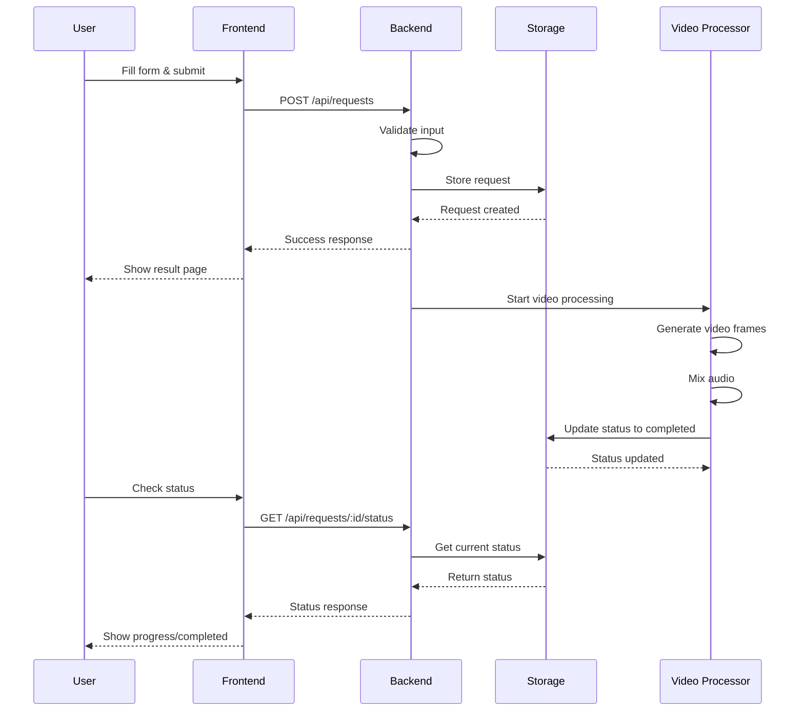
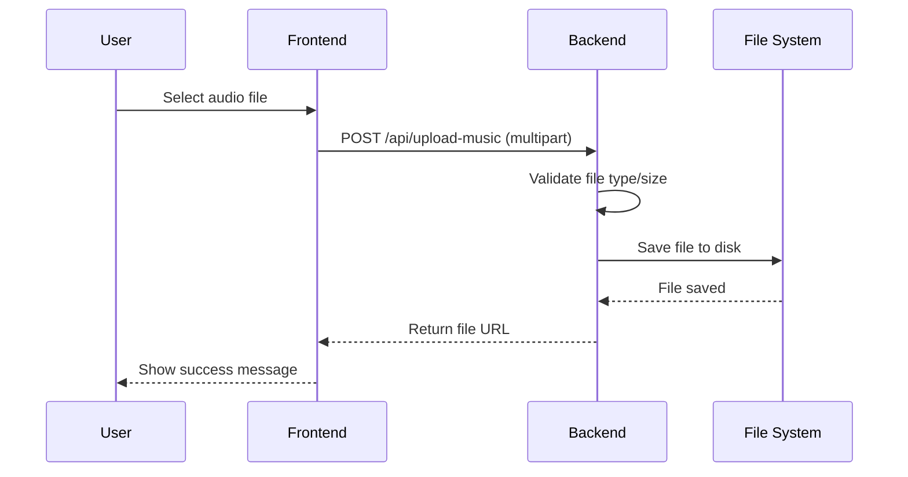

# 🏗️ Architecture

## Overview

SendLove is a modern full-stack web application built with a microservices-inspired architecture, focusing on video message generation. The application follows clean architecture principles with clear separation of concerns.

**Repository**: [https://github.com/Djochrist/SendLove](https://github.com/Djochrist/SendLove)

## System Architecture

```
┌─────────────────┐    ┌─────────────────┐    ┌─────────────────┐
│   Frontend      │    │   Backend API   │    │   Storage       │
│   (React)       │◄──►│   (Express)     │◄──►│   (JSON/FS)     │
│                 │    │                 │    │                 │
│ • User Interface│    │ • REST API      │    │ • File Storage  │
│ • State Mgmt    │    │ • Video Proc.   │    │ • Data Persist. │
│ • Routing       │    │ • File Upload   │    │ • Cache Layer   │
└─────────────────┘    └─────────────────┘    └─────────────────┘
         │                       │                       │
         └───────────────────────┼───────────────────────┘
                                 │
                    ┌─────────────────┐
                    │   FFmpeg        │
                    │   Processing    │
                    │                 │
                    │ • Video Gen.    │
                    │ • Audio Mix.    │
                    │ • Format Conv.  │
                    └─────────────────┘
```

## Technology Stack

### Frontend Layer

```
React 18 + TypeScript
├── Vite (Build Tool)
├── Tailwind CSS (Styling)
├── Framer Motion (Animations)
├── React Query (Data Fetching)
├── Wouter (Routing)
├── Radix UI (Components)
└── Lucide React (Icons)
```

### Backend Layer

```
Node.js + Express + TypeScript
├── FFmpeg.wasm (Video Processing - Future)
├── Multer (File Upload)
├── JSON File Storage (MVP Database)
├── PostgreSQL (Production Database - Planned)
├── Zod (Validation)
├── Passport.js (Auth - Future)
└── Connect-PG-Simple (Sessions - Future)
```

### Infrastructure

```
Development & Deployment
├── Docker (Containerization)
├── GitHub Actions (CI/CD)
├── ESLint + Prettier (Code Quality)
├── tsx (TypeScript Execution)
└── Vite (Development Server)
```

## Application Structure

### Directory Structure

```
sendlove/
├── client/                 # Frontend Application
│   ├── src/
│   │   ├── components/     # Reusable UI Components
│   │   ├── pages/         # Page Components
│   │   ├── hooks/         # Custom React Hooks
│   │   ├── lib/           # Utilities & Libraries
│   │   └── ...
│   ├── public/            # Static Assets
│   └── index.html
├── server/                 # Backend Application
│   ├── index.ts           # Server Entry Point
│   ├── routes.ts          # API Route Handlers
│   ├── storage.ts         # Data Persistence Layer
│   ├── video-processor.ts # Video Generation Logic
│   └── ...
├── shared/                 # Shared Code
│   ├── schema.ts          # Data Schemas & Types
│   └── routes.ts          # API Route Definitions
├── script/                 # Build & Utility Scripts
├── doc/                   # Documentation
└── ...
```

## Component Architecture

### Frontend Components

#### Page Components (`client/src/pages/`)

- **Home**: Landing page with hero section and call-to-action
- **Create**: Multi-step form for creating video requests
- **Result**: Video display and sharing page
- **NotFound**: 404 error page

#### UI Components (`client/src/components/`)

- **HeartParticles**: Animated background particles
- **PremiumButton**: Styled call-to-action button
- **MusicPlayer**: Audio preview component
- **UploadModal**: File upload interface
- **VideoCard**: Video display component

#### Custom Hooks (`client/src/hooks/`)

- **use-requests**: API calls for video requests
- **use-videos**: Video-related state management
- **use-toast**: Toast notification system
- **use-mobile**: Responsive design utilities

### Backend Components

#### Route Handlers (`server/routes.ts`)

- **POST /api/requests**: Create video request
- **GET /api/requests/:id**: Get request details
- **GET /api/requests/:id/status**: Get processing status
- **POST /api/upload-music**: Handle music uploads
- **GET /api/requests/:id/video**: Serve generated video

#### Storage Layer (`server/storage.ts`)

```typescript
interface IStorage {
  createRequest(request: CreateVideoRequest): Promise<VideoRequest>;
  getRequest(id: string): Promise<VideoRequest | undefined>;
  updateStatus(id: string, status: VideoRequest["status"], progress: number, url?: string): Promise<VideoRequest>;
}
```

#### Video Processor (`server/video-processor.ts`)

- FFmpeg.wasm integration for client-side video processing
- Support for multiple audio formats
- Text-to-video rendering pipeline

## Data Flow

### Video Creation Flow



### File Upload Flow



## State Management

### Frontend State

The frontend uses React Query for server state management and React's built-in state for local UI state.

#### Server State (React Query)
- Video request data
- Processing status
- API responses

#### Local State (React useState)
- Form data
- UI interactions
- Modal states

### Backend State

The backend uses file-based JSON storage for data persistence (MVP approach).

#### Data Storage Structure

```json
{
  "requests": {
    "req_1234567890": {
      "id": "req_1234567890",
      "senderName": "Alice",
      "receiverName": "Bob",
      "message": "Cher Bob...",
      "music": "romantic",
      "status": "completed",
      "progress": 100,
      "videoUrl": "/api/requests/req_1234567890/video",
      "createdAt": "2024-01-15T10:30:00.000Z"
    }
  }
}
```

## Security Architecture

### Input Validation

- **Zod schemas** for runtime type validation
- **Word count limits** to prevent abuse
- **File type validation** for uploads
- **Size limits** on file uploads (10MB)

### Data Protection

- **No permanent data storage** (MVP approach)
- **File cleanup** after processing
- **Secure file handling** with proper permissions
- **CORS configuration** for web security

### Future Security Enhancements

- User authentication and authorization
- Rate limiting
- Input sanitization
- HTTPS enforcement
- Content moderation

## Performance Considerations

### Frontend Optimization

- **Code splitting** with Vite
- **Lazy loading** of components
- **Image optimization** with modern formats
- **Bundle analysis** and tree shaking

### Backend Optimization

- **Streaming responses** for large files
- **Caching layers** for static assets
- **Connection pooling** for database
- **Async processing** for video generation

### Video Processing

- **FFmpeg.wasm** for client-side processing
- **Progressive loading** of video content
- **Format optimization** for web delivery
- **CDN integration** for asset delivery

## Scalability

### Current Limitations (MVP)

- File-based storage (not suitable for production)
- Single-threaded video processing
- No caching layer
- No CDN integration

### Future Scalability Improvements

- **Database migration** (PostgreSQL/MySQL)
- **Queue system** (Redis/RabbitMQ)
- **Microservices** architecture
- **Horizontal scaling** with load balancers
- **CDN integration** (Cloudflare/AWS CloudFront)

## Deployment Architecture

### Development Environment

```
Local Development
├── Vite Dev Server (Frontend)
├── Express Server (Backend)
├── File-based Storage
└── Local FFmpeg Processing
```

### Production Environment

```
Cloud Deployment
├── Static Hosting (Frontend)
├── App Server (Backend)
├── Managed Database
├── CDN (Assets)
└── Background Workers (Video Processing)
```

## Monitoring & Observability

### Current Monitoring

- **Console logging** for debugging
- **Error handling** with try-catch blocks
- **Status tracking** for video processing

### Future Monitoring

- **Application metrics** (response times, error rates)
- **Performance monitoring** (Core Web Vitals)
- **Error tracking** (Sentry/Bugsnag)
- **Log aggregation** (ELK stack)

## Testing Strategy

### Unit Tests

- Component testing with React Testing Library
- API testing with Supertest
- Utility function testing with Jest

### Integration Tests

- End-to-end API testing
- Database integration testing
- File upload testing

### E2E Tests

- User journey testing with Playwright
- Cross-browser compatibility testing

## Development Workflow

### Code Quality

- **ESLint** for code linting
- **Prettier** for code formatting
- **TypeScript** for type checking
- **Husky** for git hooks

### CI/CD Pipeline

```yaml
# GitHub Actions Workflow
name: CI/CD
on: [push, pull_request]
jobs:
  test:
    runs-on: ubuntu-latest
    steps:
      - uses: actions/checkout@v3
      - uses: actions/setup-node@v3
        with:
          node-version: '18'
      - run: npm ci
      - run: npm run check
      - run: npm test
  deploy:
    needs: test
    runs-on: ubuntu-latest
    steps:
      - name: Deploy to production
        # Deployment steps...
```

## Migration Path

### From MVP to Production

1. **Database Migration**
   - Replace JSON storage with PostgreSQL
   - Implement proper migrations
   - Add database indexing

2. **Video Processing**
   - Move to server-side FFmpeg
   - Implement background job processing
   - Add video storage (S3/Cloud Storage)

3. **Authentication**
   - Implement user registration/login
   - Add OAuth integration
   - Secure API endpoints

4. **Scalability**
   - Implement caching (Redis)
   - Add load balancing
   - Set up monitoring

## Conclusion

SendLove's architecture provides a solid foundation for a video message generation platform. The clean separation of concerns, modern technology stack, and scalable design patterns ensure the application can grow from MVP to production-ready service.

The modular architecture allows for easy extension and modification, while the focus on performance and user experience ensures a smooth, engaging user journey.

---

<div align="center">

[← API Reference](api.md) • [Deployment Guide →](deployment.md)

</div>
